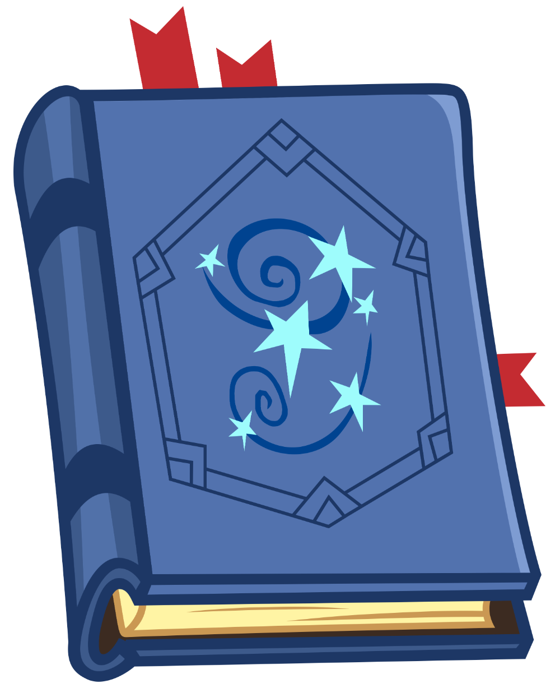

# SpellLearning
Индивидуальный проект по теме: Spell Learning

  

🧙‍♂️ SpellLearning
SpellLearning - это интерактивная веб-платформа, сочетающая в себе элементы коллекционной карточной игры, кликер-майнинга и платформера с магической тематикой.

✨ Основные возможности
🎴 Гэча-система с магическими картами
Коллекционируйте редкие карты заклинаний через систему gacha

Уникальные артефакты и магические предметы для коллекции

Различные редкости карт: от обычных до легендарных

⛏️ Магический кликер-майнинг
Зарабатывайте магическую энергию кликами

Улучшайте добычу маны с помощью апгрейдов

Тратьте энергию на получение новых карт в gacha

🎮 Экшн-платформер
Сражайтесь с врагами используя собранные заклинания

Система выбора 5 заклинаний перед битвой

Динамичные бои в реальном времени

👥 Социальные функции
Регистрация и система профилей

Обмен картами между игроками

Рейтинги и достижения

🚀 Технологии
Frontend: React.js / Vue.js с анимациями

Backend: ASP.NET Core Web API

Database: PostgreSQL/MongoDB для хранения карт

Authentication: JWT для безопасности

Game Engine: Phaser.js для игровой части

🎯 Игровой процесс
Зарабатывайте ману через кликер-майнинг

Получайте карты через gacha-систему

Составляйте колоду из 5 заклинаний

Сражайтесь в платформере против врагов

Обменивайтесь дубликатами карт с другими игроками 

